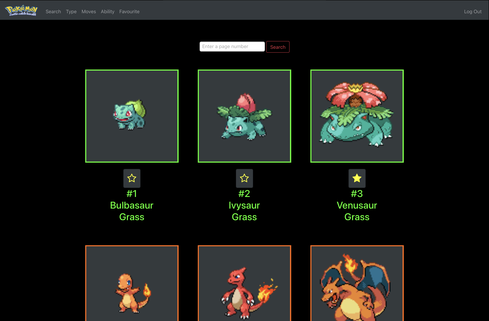

# My CS50x Final Project
## About
This is my final project for [Harvard CS50x](https://cs50.harvard.edu/x/2020/) course. It is a website for pokemons where you can view information about them just like the pokedex. Users need to create an account and login to use the website. They can star pokemons they like to add it to their favourites list. Users can also search for pokemons by their properties such as their *Name or Global ID*, *Type or Type ID*, *Moves* and *Abilities*.

## Description
I imported the data from [PokeApi](https://pokeapi.co/) and saved them in the database so that I can use them later when I run flask.

The home page displays all the pokemons. You can only see some of them at a time and use either the *Next* and *Previous* buttons to navigate to other pages or use the search bar to directly jump into a specific page.\
\
**Search** button on the navigation bar allows you to search either for pokemons with similar names or their Global ID.\
\
**Type** allows you to search for pokemons by their Type or Type ID.\
\
You can also search for pokemons that have specific moves/ability by clicking those on the navigation bar.


If you have starred some pokemons you can find them in **Favourites**!

Clicking any pokemon shows you another page where you can see the image, stats, moves and abilities of the pokemon you had clicked. When you click any properties of the pokemon it searches them for you instead of searching them manually.

A file called [log.txt](https://github.com/Amjuks/My-CS50-Project/blob/master/log.txt) keeps log of all the actions the user does on the website, mainly for debugging reason.

## Youtube

#### https://youtu.be/19_u2v3y2vk

## Tech
### Python
I used [Python version 3.7.9](https://www.python.org/downloads/release/python-379/) for this project with [Flask](https://flask.palletsprojects.com/en/1.1.x/) framework. [Werkzeug library](https://pypi.org/project/Werkzeug/) was imported for security reason(to hash passwords) and to catch server errors and exceptions. For running SQL queries, [CS50 library](https://cs50.readthedocs.io/libraries/cs50/python/) was imported. At the end, I created my own python module called [pokeBackend](https://github.com/Amjuks/My-CS50-Project/blob/master/pokeBackend.py) and imported functions to search those pokemons, log user actions and others.

### SQL
[SQLite version 3.34.0](https://sqlite.org/index.html) of SQL was used to manage data in the database. As said the [CS50 library](https://cs50.readthedocs.io/libraries/cs50/python/) was used to run SQL commands.
The basic structure of database looks like the ones below.

#### Table dex - *Stores information about pokemons*
This table is a bit complex. Basically it stores information for a pokemon on each row, the same as a pokedex as the terminology goes.

| ID | Name      | Type     | Attack | Defense | Hitpoint | Special Attack | Special Defense | Speed | Weight | Moves           | Ability     | Image_URL                                                                                                |
|:--:|:---------:|:--------:|:------:|:-------:|:--------:|:--------------:|:---------------:|:-----:|:------:|:---------------:|:-----------:|:--------------------------------------------------------------------------------------------------------:|
| 1  | Bulbasaur | Grass... | 49     | 49      | 45       | 65             | 65              | 45    | 69     | Razor Wind...   | Overgrow... |  |
| 2  | Ivysaur   | Grass... | 62     | 63      | 60       | 80             | 80              | 60    | 130    | Swords Dance... | Overgrow... |      |
| 3  | Venusaur  | Grass... | 82     | 83      | 80       | 100            | 100             | 80    | 1000   | Vine Whip...    | Overgrow... |    |

...with a lot more rows.

#### Table users - *Stores user credentials*
This table is a lot more easier to understand has a very simple structure. It stores the user ID(*Unique for every user*), username, password hash, and the favourites that the user has starred.

| ID | Name | Hash | Favourites |
| -- | ---- | ---- | ---------- |
| 1 | Amjuks | pbkdf2:sha256:150000$5i7wx2FM$14a0a74996f3dfbf8bf07bd7d... | 3 6 9 18 22 24 28 41 49 63 64 65 71 |
| 2 | User2 | pbkdf2:sha256:150000$Od77lrPW$a62187fd84a6acb62b4709f61c... | 7 3 92 84 |

As you can see the password hashes are stored instead of the actual password for security reasons.

### HTML, CSS and Javascript
- [HTML 5](https://en.wikipedia.org/wiki/HTML5) is used for HTML. [Jinja version 2.11](https://jinja.palletsprojects.com/en/2.11.x/) was used to autogenerate HTML using python.
- [CSS](https://en.wikipedia.org/wiki/CSS) was implemented using my own [stylesheet](https://github.com/Amjuks/My-CS50-Project/blob/master/static/style.css) and a bit of [Bootstrap](https://getbootstrap.com). [Font Awesome](https://fontawesome.com) was used to display the star icons.
- [Javascript](https://www.javascript.com) was used with HTML to replace some stuff done with python(Errors when the input feilds are empty instead of redirecting into another page)

## <a href="setup"></a>Setup
Follow the instructions below to run this on your computer.
### Prerequisites
- [Python version 3.7.9](https://www.python.org/downloads/release/python-379/)
- [Git](https://git-scm.com/book/en/v2/Getting-Started-Installing-Git) to clone the repository.(Alternatively you can download the [zip folder](https://github.com/Amjuks/My-CS50-Project/archive/master.zip) and unzip it)
- Following python libraries
    - [Werkzeug library](https://pypi.org/project/Werkzeug/)
    - [CS50 library](https://cs50.readthedocs.io/libraries/cs50/python/)
    - [Flask library](https://pypi.org/project/Flask/)
    - [flask_session](https://pypi.org/project/Flask-Session/)
    - [tempfile](https://docs.python.org/3/library/tempfile.html)

### Cloning the repository
Run these commands line by line to clone the repository on your local computer.
```
mkdir pokedex
cd pokedex
git clone https://github.com/Amjuks/My-CS50-Project.git
cd My-CS50-Project
rm -f -r images (Remove the images folder manually if this command doesn't work)
```
#### **After installing those set the *`FlASK_APP`* environment variable.**
*Rename `application.py` to `app.py` before defining the variable*
- Standard Way ```export FLASK_APP=app.py```
- For Windows ```set FLASK_APP=app.py```
- For Powershell ```$env:FLASK_APP = "app.py"```

Once you have completed all those, open (My-CS50-Project) directory where `app.py` is found using the terminal. Execute the commands below to import the data using api.

This is going to run the program for importing
> python import.py

After running this you would have to answer how many pokemons you want to import. After specifying those the imported data would be printed in the terminal.
## Running the app
Once you are done setting up the app you can run it! In your terminal windows where your `app.py` is located, execute `flask run`.

If it gives you the error below you have to rename *application.py* to *app.py* and set the FLASK_APP variable by following the instructions under [setup](#setup).

`Error: Could not locate a Flask application. You did not provide the "FLASK_APP" environment variable, and a "wsgi.py" or "app.py" module was not found in the current directory.`

This would print a link where your flask app is hosted and you are done!

*[log.txt](https://github.com/Amjuks/My-CS50-Project/blob/master/log.txt) has logs of all the actions that are done on the website*

## Credits
- [PokeApi](https://pokeapi.co/) for the data.
- [Bootstrap](https://getbootstrap.com) for styling.
- [Font Awesome](https://fontawesome.com) for icons.
